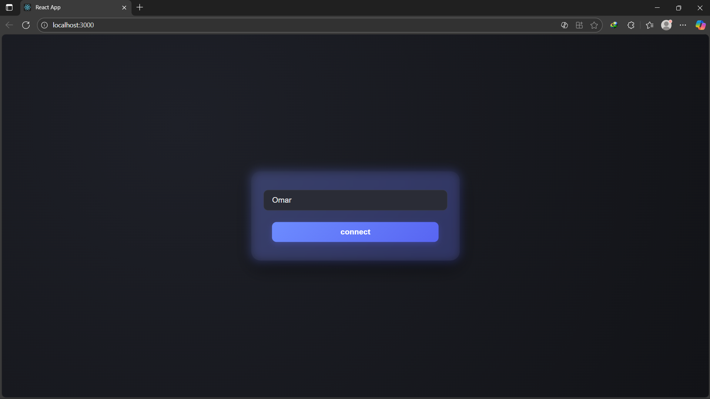
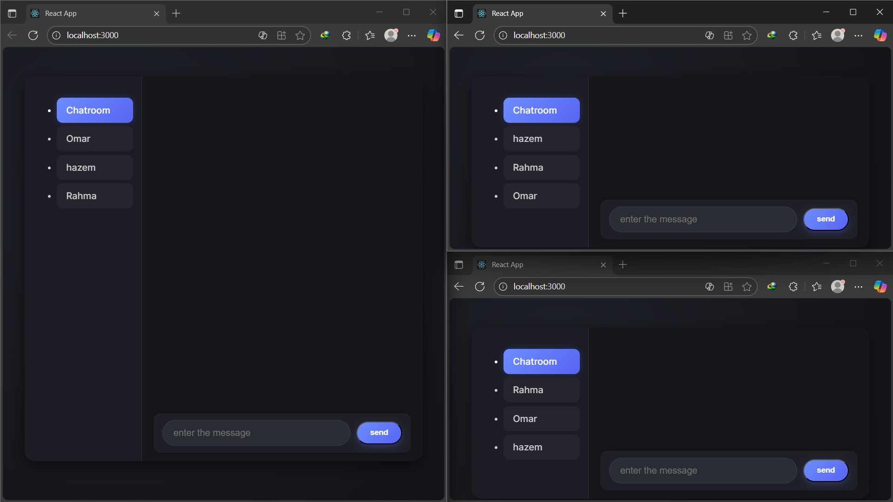
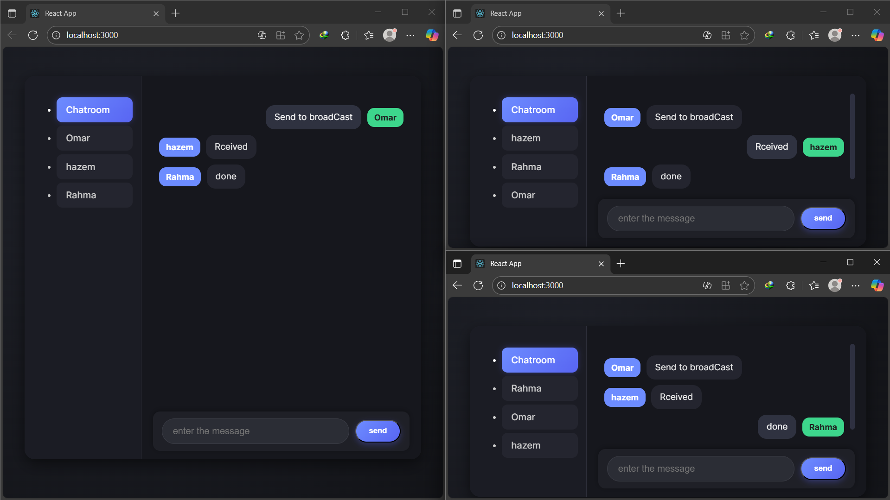
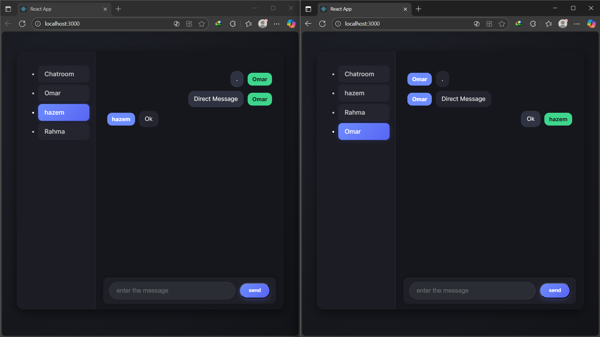

# ChatApplication
Spring boot websocket backend and reactjs client

Server:
    - Spring boot Websocket

Client
    - ReactJS

## ReactJS screen

To start:
    
### Client
        - npm install (in the react-client folder)
        - npm start
    
### Server
        - mvn spring-boot:run (in the spring-ws-server)